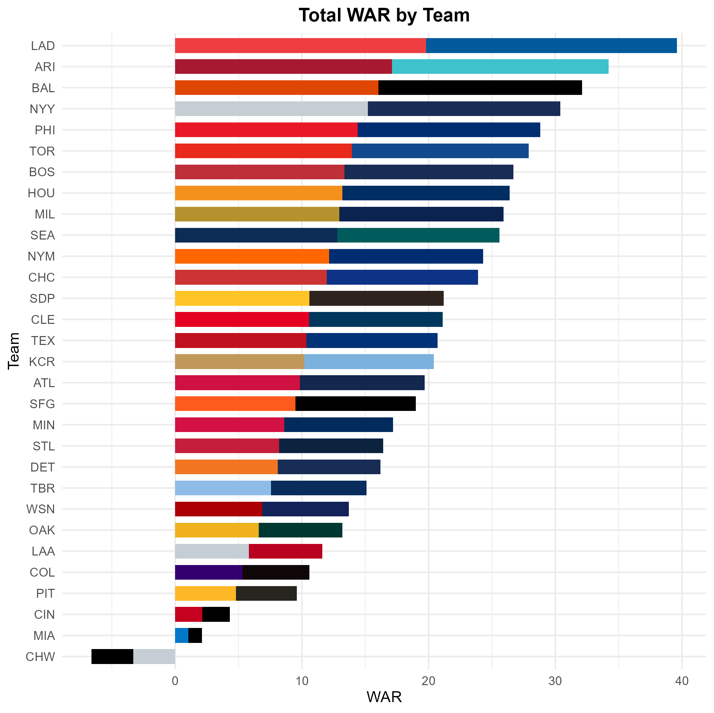

# 🧢 First R Programming Project: Exploring MLB Hitting Stats with R

## 📊 Objective

This project uses **2024 MLB hitting statistics** to explore and visualize team and player performance using the **R programming language**. It's my first full project in R and served as a hands-on way to learn:

- Data import and cleaning (`readr`, `dplyr`)
- Summarization and grouping (`group_by`, `summarize`)
- Data visualization (`ggplot2`)
- Table formatting (`gt`)
- File export (`ggsave`, HTML, CSV, PDF)

---

  

    <h2>⚾️ Features & Highlights</h2>
    <ul>
      <li>📥 Load and clean raw CSVs of MLB player statistics</li>
      <li>📊 Generate <strong>team-level summaries</strong> including WAR, batting average, OBP, and more</li>
      <li>🎨 Create dynamic bar plots using <strong>primary + secondary team colors</strong></li>
      <li>📈 Top 10 leaderboards for hitting categories (HR, Hits, Walks, SB)</li>
      <li>📋 Publish styled HTML tables using the <code>gt</code> package</li>
      <li>📁 Save plots and tables to <strong>PDF</strong>, <strong>PNG</strong>, and <strong>HTML</strong> formats</li>
    </ul>
  

  

    <h2>📊 WAR by Team</h2>
    
  

---

## 🛠️ Skills Practiced

- `tidyverse` fundamentals  
- `ggplot2` for custom plotting  
- `gt` for presentation-quality tables  
- `mapply`, `text_transform` for conditional formatting  
- Data joins and filtering with `left_join()` and `%in%`  
- Exporting high-quality visuals and summaries  

---

## 📁 Files Included

- `mlb_bat_2024.csv`: Raw batting stats  
- `team_colors.csv`: Primary/secondary team color mappings  
- `team_summary_2024.html`: Output summary table  
- `team_war.png`: WAR bar chart with dual-color fill  
- `project_script.R`: End-to-end code and workflow  

---

